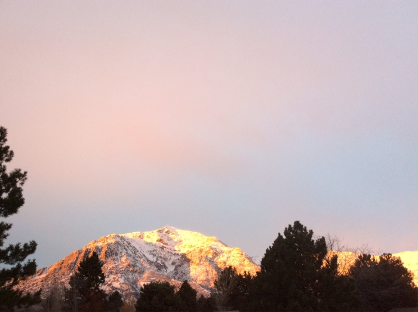

Hello and welcome to Backcountry Basics! My name is Nathan and I am a full-time university student and an avid adventurer. I love being outside and enjoying the wonders that are everywhere. I have engaged in many different recreational activities and this website is my attempt to share my experiences and knowledge with the world. Everything is geared towards those who may not be familiar with the outdoor community, but want to become more involved.

During high school, I was a whitewater raft and kayak guide and climbing instructor for four summers. This gave me a glimpse into the world of professional recreation and I absolutely loved it. Since then I have looked for additional opportunities to help others enjoy the natural world in different ways. I again have a summer job guiding, but this time in Southern Utah. With school and my part-time day job, I have not been able to get outside as much as I would have wanted. This led me to think of something that could at least allow me to talk about the things that I find so much joy in. That prompted the creation of Backcountry Basics, a site that would allow me to share my passion for outdoor recreation.

As you read through the articles, I hope that you find answers to questions you may have. If you enjoy the content, feel free to make a donation to support future content.
