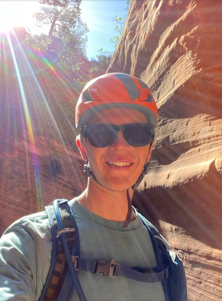

Hello and welcome to Backcountry Basics! My name is Nathan and I am a recreational advocate, university student, and self-proclaimed tree-hugger. This blog began as an attempt to invite everyone to get involved in outdoor recreation and appreciate the beauties of the natural world. I have guided professionally for over five years helping people enjoy whitewater rafting and kayaking, climbing, canyons, and hiking. Most recently I have been working at a ropes course facilitating groups in a variety of different activities. Each of these, along with personal experiences in the outdoors, have shaped my desire to share these activities with others.

As I have been writing these articles, however, I have come to recognize that it is not enough to just get people outside. It is crucial that everyone learns their responsibility as stewards of our incredible Earth. The world is changing, and generally, it is not for the better. I believe that part of the reason for this is a general disconnect between people and the natural world; I want to change that. Because of this most of the articles I have been writing are now about experiences I've had or perspectives on sustainability and stewardship that I feel are important for all to understand. 

In short, I write because I love this planet. If you feel that any of these articles may be impactful to someone else, please share them. And if you feel the urge, I appreciate any and all donations to help support me as I continue to write. Thanks for reading, now go out and explore somewhere new!

Follow me on Instagram @backcountry_nathan to see what adventures I've most recently had